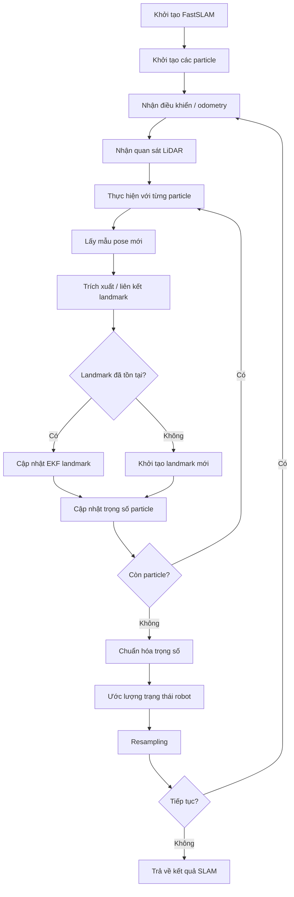
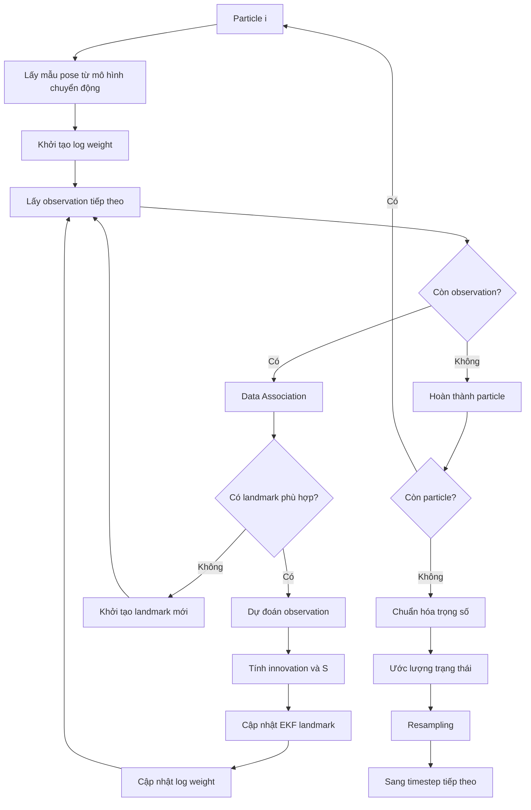
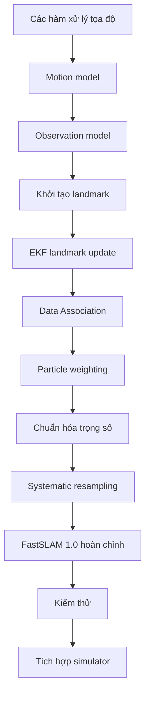

# FastSLAM

> Đặc tả thuật toán SLAM cho mô phỏng robot hút bụi 2D.
>
> **Thuật toán chính:** FastSLAM 1.0  
> **Nhóm thuật toán:** Rao-Blackwellized Particle Filter (RBPF)  
> **Loại SLAM:** SLAM dựa trên landmark  
> **Cảm biến:** LiDAR 2D / cảm biến khoảng cách mô phỏng  
> **Cài đặt:** Tự cài đặt, không sử dụng thư viện SLAM bên ngoài

---

# 1. Phạm vi

Tài liệu này đặc tả thuật toán SLAM được sử dụng trong mô phỏng robot hút bụi.

Nội dung của tài liệu bao gồm:

- mô hình xác suất của bài toán SLAM;
- cách biểu diễn trạng thái robot và landmark;
- mô hình chuyển động của robot;
- mô hình quan sát của cảm biến;
- khởi tạo landmark;
- Data Association;
- cập nhật landmark bằng EKF;
- tính trọng số cho particle;
- Resampling;
- toàn bộ một vòng lặp FastSLAM;
- các trường hợp đặc biệt và vấn đề số học;
- phương pháp kiểm thử và đánh giá thuật toán.

Tài liệu này mô tả **bản thân thuật toán**, không mô tả kiến trúc tổng thể của chương trình mô phỏng.

Kiến trúc chương trình, cấu trúc module và giao diện giữa các module được mô tả riêng trong:

```text
architecture.md
interfaces.md
requirements.md
```

---

# 2. Lựa chọn thuật toán

## 2.1 Thuật toán được lựa chọn

Project sử dụng **FastSLAM 1.0** làm thuật toán SLAM chính.

FastSLAM được Montemerlo và cộng sự giới thiệu như một cách xây dựng SLAM dựa trên Rao-Blackwellized Particle Filter. Thay vì duy trì một phân phối Gaussian chung rất lớn cho robot và toàn bộ landmark, FastSLAM sử dụng các particle để biểu diễn sự không chắc chắn của quỹ đạo robot, đồng thời duy trì một bộ ước lượng riêng cho từng landmark.

FastSLAM khai thác phân tích xác suất:

\[
\boxed{
\begin{aligned}
&p(x_{1:t}, m \mid z_{1:t}, u_{1:t})\\[4pt]
&\quad =
p(x_{1:t} \mid z_{1:t}, u_{1:t})
\prod_{j=1}^{N}
p(m_j \mid x_{1:t}, z_{1:t}, u_{1:t})
\end{aligned}
}
\]

Trong đó:

- \(x_{1:t}\): quỹ đạo robot từ thời điểm 1 đến \(t\);
- \(m_j\): landmark thứ \(j\);
- \(z_{1:t}\): các quan sát từ cảm biến;
- \(u_{1:t}\): các điều khiển hoặc thông tin odometry.

Đây là ý tưởng quan trọng nhất của FastSLAM.

---

## 2.2 Tại sao chọn FastSLAM 1.0?

FastSLAM 1.0 được chọn vì:

1. phù hợp với mục đích học tập và tự cài đặt;
2. có cấu trúc Particle Filter rõ ràng;
3. phù hợp với mô hình chuyển động phi tuyến của robot;
4. có khả năng biểu diễn nhiều giả thuyết khác nhau về vị trí robot;
5. đơn giản hơn FastSLAM 2.0;
6. phù hợp với môi trường mô phỏng 2D;
7. thể hiện rõ mối quan hệ giữa Particle Filter và EKF.

FastSLAM 2.0 cải thiện phân phối đề xuất bằng cách sử dụng thêm thông tin từ quan sát hiện tại khi dự đoán vị trí robot.

Tuy nhiên, FastSLAM 2.0 **không phải phiên bản cơ sở của project**.

Nó có thể được triển khai sau dưới dạng phần mở rộng.

---

# 3. Tổng quan thuật toán

FastSLAM có thể được nhìn dưới dạng ba thành phần chính:

```text
SLAM
│
├── Particle Filter
│   └── biểu diễn sự không chắc chắn của quỹ đạo robot
│
└── Bộ ước lượng landmark
    └── một EKF cho mỗi landmark trong mỗi particle
```

Mỗi particle chứa:

```text
Particle
├── pose robot
│   ├── x
│   ├── y
│   └── theta
│
├── trọng số
│
└── bản đồ landmark
    ├── landmark 0 → EKF
    ├── landmark 1 → EKF
    ├── landmark 2 → EKF
    └── ...
```

Điểm quan trọng:

> **Particle biểu diễn sự không chắc chắn về quỹ đạo robot, còn EKF biểu diễn sự không chắc chắn của landmark khi đã biết quỹ đạo đó.**

Đây chính là cấu trúc Rao-Blackwellized của FastSLAM.

---

# 4. Luồng thuật toán tổng quát

FastSLAM có thể được biểu diễn bằng flowchart sau:



Trình tự xử lý cơ bản:

```text
chuyển động
    ↓
quan sát
    ↓
Data Association
    ↓
cập nhật landmark / khởi tạo landmark
    ↓
tính trọng số particle
    ↓
chuẩn hóa trọng số
    ↓
Resampling
```

---

# 5. Các giả định

Phiên bản cơ sở sử dụng các giả định:

- môi trường là 2D;
- robot chuyển động trên một mặt phẳng;
- pose robot được biểu diễn bằng \((x,y,\theta)\);
- landmark được biểu diễn bằng điểm 2D;
- chuyển động của robot có nhiễu;
- phép đo cảm biến có nhiễu Gaussian;
- landmark là tĩnh trong một lần chạy SLAM;
- quan sát có thể được biểu diễn dưới dạng khoảng cách và góc;
- mỗi quan sát có thể được liên kết với landmark đã biết hoặc được xem là landmark mới;
- số lượng particle là hữu hạn;
- ground truth chỉ được sử dụng để mô phỏng cảm biến và đánh giá kết quả;
- ground truth không được cung cấp trực tiếp cho FastSLAM.

Thuật toán **không được sử dụng**:

```text
ground_truth_pose
ground_truth_map
```

để cập nhật trạng thái SLAM.

---

# 6. Biểu diễn trạng thái

## 6.1 Pose robot

Trạng thái robot:

\[
\mathbf{x}_t =
\begin{bmatrix}
x_t\\
y_t\\
\theta_t
\end{bmatrix}
\]

Trong đó:

- \(x_t\): tọa độ theo trục \(x\);
- \(y_t\): tọa độ theo trục \(y\);
- \(\theta_t\): góc quay của robot.

Pose thuộc không gian chuyển động phẳng \(SE(2)\), tuy nhiên trong cài đặt có thể sử dụng trực tiếp vector:

```text
(x, y, theta)
```

---

## 6.2 Trạng thái landmark

Landmark thứ \(j\):

\[
\mathbf{m}_j =
\begin{bmatrix}
m_{j,x}\\
m_{j,y}
\end{bmatrix}
\]

Mỗi landmark có một ma trận covariance:

\[
\boldsymbol{\Sigma}_j =
\begin{bmatrix}
\sigma_x^2 & \sigma_{xy}\\
\sigma_{xy} & \sigma_y^2
\end{bmatrix}
\]

Do đó một landmark có thể được biểu diễn:

```text
Landmark
├── mean: [x, y]
├── covariance: 2 × 2
└── initialized: true/false
```

---

## 6.3 Trạng thái particle

Particle thứ \(i\):

\[
P^{[i]} =
\left(
x_{1:t}^{[i]},
m^{[i]},
w^{[i]}
\right)
\]

Trong đó:

- \(x_{1:t}^{[i]}\): giả thuyết quỹ đạo;
- \(m^{[i]}\): bản đồ landmark tương ứng;
- \(w^{[i]}\): trọng số của particle.

Trong cài đặt thực tế, nếu không cần lưu toàn bộ lịch sử quỹ đạo thì chỉ cần lưu pose hiện tại.

---

# 7. Hệ tọa độ

Thuật toán sử dụng hai hệ tọa độ.

## 7.1 Hệ tọa độ thế giới

Hệ tọa độ thế giới cố định:

```text
y ↑
  │
  │
  └────────→ x
```

Vị trí landmark được lưu trong hệ tọa độ này.

---

## 7.2 Hệ tọa độ robot

Hệ tọa độ robot di chuyển cùng robot:

```text
x → phía trước
y → bên trái
```

Quan sát từ cảm biến được biểu diễn tương đối với hệ tọa độ robot.

---

## 7.3 Chuyển từ robot frame sang world frame

Với pose:

\[
\mathbf{x}_r =
\begin{bmatrix}
x_r\\
y_r\\
\theta
\end{bmatrix}
\]

và điểm trong robot frame:

\[
\mathbf{p}_r =
\begin{bmatrix}
x'_r\\
y'_r
\end{bmatrix}
\]

điểm trong world frame:

\[
\boxed{
\mathbf{p}_w =
\begin{bmatrix}
x_r\\
y_r
\end{bmatrix}
+
R(\theta)\mathbf{p}_r
}
\]

với:

\[
R(\theta)=
\begin{bmatrix}
\cos\theta & -\sin\theta\\
\sin\theta & \cos\theta
\end{bmatrix}
\]

Phép biến đổi này được sử dụng khi khởi tạo landmark mới.

---

# 8. Mô hình chuyển động

FastSLAM cần mô hình chuyển động xác suất:

\[
p(\mathbf{x}_t \mid \mathbf{x}_{t-1},\mathbf{u}_t)
\]

Trong đó:

- \(\mathbf{x}_{t-1}\): pose trước đó;
- \(\mathbf{u}_t\): điều khiển hoặc odometry;
- \(\mathbf{x}_t\): pose mới.

Simulator nên cung cấp ít nhất:

```text
u_t = [distance, rotation]
```

hoặc một dạng odometry tương đương.

---

## 8.1 Mô hình chuyển động đơn giản

Với:

\[
\mathbf{u}_t =
\begin{bmatrix}
\Delta s\\
\Delta\theta
\end{bmatrix}
\]

ta có thể mô hình hóa chuyển động:

\[
\boxed{
\mathbf{x}_t =
\mathbf{x}_{t-1}
+
\begin{bmatrix}
\Delta s\cos\theta_{t-1}\\
\Delta s\sin\theta_{t-1}\\
\Delta\theta
\end{bmatrix}
}
\]

Đây chỉ là chuyển động xác định.

Trong FastSLAM, cần thêm nhiễu chuyển động.

Ví dụ:

\[
\Delta s'=\Delta s+\epsilon_s
\]

\[
\Delta\theta'=\Delta\theta+\epsilon_\theta
\]

với:

\[
\epsilon_s\sim\mathcal{N}(0,\sigma_s^2)
\]

và:

\[
\epsilon_\theta\sim\mathcal{N}(0,\sigma_\theta^2)
\]

---

# 9. Mô hình cảm biến

## 9.1 Biểu diễn quan sát

Mặc dù cảm biến vật lý trong mô phỏng là LiDAR 2D, phần FastSLAM cơ sở sử dụng quan sát landmark dạng:

\[
\mathbf{z}_t^j =
\begin{bmatrix}
r\\
\phi
\end{bmatrix}
\]

Trong đó:

- \(r\): khoảng cách từ robot đến landmark;
- \(\phi\): góc của landmark so với hướng robot.

Với landmark:

\[
\mathbf{m}_j=(m_x,m_y)
\]

và robot:

\[
(x,y,\theta)
\]

ta có:

\[
\Delta x=m_x-x
\]

\[
\Delta y=m_y-y
\]

Khoảng cách:

\[
r=\sqrt{(\Delta x)^2+(\Delta y)^2}
\]

Góc:

\[
\phi=
\operatorname{atan2}(\Delta y,\Delta x)-\theta
\]

Góc phải được chuẩn hóa về:

\[
[-\pi,\pi)
\]

---

# 10. Chuyển LiDAR scan thành quan sát landmark

FastSLAM không yêu cầu raw LiDAR scan phải được biểu diễn trực tiếp thành occupancy grid.

Pipeline của project:

```text
LiDAR scan
    ↓
lọc giá trị không hợp lệ
    ↓
trích xuất feature / landmark
    ↓
tạo quan sát range-bearing
    ↓
FastSLAM
```

Một scan gồm nhiều phép đo:

\[
z_k=(r_k,\phi_k)
\]

Để sử dụng FastSLAM landmark-based, cần có bước trích xuất feature để biến scan thành các landmark có thể nhận dạng.

Có thể sử dụng:

- landmark dạng điểm được tạo sẵn trong simulator;
- phát hiện corner;
- giao điểm của các đoạn thẳng;
- gom nhóm các điểm từ LiDAR;
- các landmark được simulator cung cấp thông qua mô phỏng cảm biến.

### Lựa chọn cho phiên bản đầu tiên

Nên sử dụng **landmark điểm được tạo sẵn trong môi trường mô phỏng**.

Điều này giúp tách riêng hai vấn đề:

```text
FastSLAM
```

và:

```text
trích xuất feature từ LiDAR
```

Sau khi FastSLAM hoạt động ổn định, landmark có thể được thay thế bằng feature thực sự trích xuất từ LiDAR.

---

# 11. Mô hình quan sát

Với landmark \(\mathbf{m}_j\) và pose robot \(\mathbf{x}_t\):

\[
\boxed{
h(\mathbf{x}_t,\mathbf{m}_j)
=
\begin{bmatrix}
\sqrt{(m_x-x)^2+(m_y-y)^2}\\[6pt]
\operatorname{atan2}(m_y-y,m_x-x)-\theta
\end{bmatrix}
}
\]

Đây là quan sát dự đoán:

\[
\hat{\mathbf{z}}_t^j=h(\mathbf{x}_t,\mathbf{m}_j)
\]

Phép đo thực tế:

\[
\mathbf{z}_t^j=h(\mathbf{x}_t,\mathbf{m}_j)+\mathbf{v}_t
\]

với:

\[
\mathbf{v}_t\sim\mathcal{N}(\mathbf{0},Q)
\]

Trong đó \(Q\) là covariance của nhiễu cảm biến:

\[
Q=
\begin{bmatrix}
\sigma_r^2 & 0\\
0 & \sigma_\phi^2
\end{bmatrix}
\]

---

# 12. Data Association

Data Association xác định quan sát hiện tại thuộc về landmark nào.

Quy trình:

```text
quan sát
    ↓
so sánh với landmark hiện có
    ↓
tính innovation
    ↓
tính mức độ tương thích
    ↓
chọn landmark phù hợp nhất
    ↓
landmark đã biết / landmark mới
```

---

## 12.1 Innovation

Với landmark ứng viên \(j\):

\[
\boldsymbol{\nu}=\mathbf{z}_t-\hat{\mathbf{z}}_t^j
\]

Thành phần góc phải được chuẩn hóa:

\[
\nu_\phi=
\operatorname{normalizeAngle}
\left(\phi-\hat{\phi}\right)
\]

---

## 12.2 Covariance của innovation

\[
\boxed{
S=H\Sigma_jH^T+Q
}
\]

Trong đó:

- \(H\): Jacobian của mô hình quan sát;
- \(\Sigma_j\): covariance của landmark;
- \(Q\): covariance nhiễu cảm biến.

---

## 12.3 Khoảng cách Mahalanobis

Mức độ tương thích:

\[
\boxed{
d^2=\boldsymbol{\nu}^T S^{-1}\boldsymbol{\nu}
}
\]

Một landmark được xem là phù hợp nếu:

\[
d^2<\gamma
\]

với \(\gamma\) là ngưỡng Data Association.

Nếu có nhiều landmark phù hợp, chọn landmark có khoảng cách Mahalanobis nhỏ nhất.

---

## 12.4 Không tìm thấy landmark

Nếu không có landmark nào vượt qua ngưỡng:

```text
quan sát
    ↓
không có landmark phù hợp
    ↓
khởi tạo landmark mới
```

Không được ép mọi quan sát phải thuộc về một landmark cũ.

---

# 13. Khởi tạo landmark

Với quan sát:

\[
\mathbf{z}=
\begin{bmatrix}
r\\
\phi
\end{bmatrix}
\]

tọa độ landmark trong robot frame:

\[
\mathbf{p}_r=
\begin{bmatrix}
r\cos\phi\\
r\sin\phi
\end{bmatrix}
\]

Sau đó chuyển sang world frame:

\[
\boxed{
\mathbf{m}=
\begin{bmatrix}
x\\
y
\end{bmatrix}
+
R(\theta)\mathbf{p}_r
}
\]

Đây là mean ban đầu của landmark.

---

## 13.1 Covariance ban đầu

Covariance của landmark phải thể hiện được độ không chắc chắn của phép đo.

Gọi:

\[
g(\mathbf{x},\mathbf{z})
\]

là mô hình chuyển ngược từ observation sang landmark.

Khi đó:

\[
\boxed{
\Sigma_m=G_z Q G_z^T
}
\]

với:

\[
G_z=\frac{\partial g}{\partial \mathbf{z}}
\]

là Jacobian của mô hình nghịch đảo theo observation.

---

# 14. Cập nhật landmark bằng EKF

Khi một observation được liên kết với landmark đã tồn tại, landmark được cập nhật bằng EKF.

Landmark có mean:

\[
\boldsymbol{\mu}_j
\]

và covariance:

\[
\Sigma_j
\]

---

## 14.1 Dự đoán observation

\[
\hat{\mathbf{z}}=h(\mathbf{x},\boldsymbol{\mu}_j)
\]

---

## 14.2 Jacobian

Đặt:

\[
q=(m_x-x)^2+(m_y-y)^2
\]

và:

\[
r=\sqrt{q}
\]

Jacobian theo tọa độ landmark:

\[
\boxed{
H=
\begin{bmatrix}
\dfrac{m_x-x}{r}
&
\dfrac{m_y-y}{r}
\\[10pt]
-\dfrac{m_y-y}{q}
&
\dfrac{m_x-x}{q}
\end{bmatrix}
}
\]

Phải xử lý trường hợp:

\[
q\approx 0
\]

vì Jacobian trở nên không ổn định khi robot ở quá gần landmark.

---

## 14.3 Innovation

\[
\boldsymbol{\nu}=\mathbf{z}-\hat{\mathbf{z}}
\]

Chuẩn hóa thành phần góc:

\[
\nu_\phi
\leftarrow
\operatorname{normalizeAngle}(\nu_\phi)
\]

---

## 14.4 Covariance của innovation

\[
S=H\Sigma_jH^T+Q
\]

---

## 14.5 Kalman Gain

\[
\boxed{
K=\Sigma_jH^TS^{-1}
}
\]

---

## 14.6 Cập nhật mean

\[
\boxed{
\boldsymbol{\mu}_j'
=
\boldsymbol{\mu}_j+K\boldsymbol{\nu}
}
\]

---

## 14.7 Cập nhật covariance

Công thức EKF cơ bản:

\[
\Sigma_j'=(I-KH)\Sigma_j
\]

Để tăng độ ổn định số học, có thể sử dụng dạng Joseph:

\[
\boxed{
\begin{aligned}
\Sigma_j'
={}&(I-KH)\Sigma_j(I-KH)^T\\
&+KQK^T
\end{aligned}
}
\]

Sau đó đảm bảo covariance đối xứng:

\[
\Sigma_j
\leftarrow
\frac{1}{2}
\left(\Sigma_j+\Sigma_j^T\right)
\]

---

# 15. Trọng số particle

Mỗi particle nhận một trọng số dựa trên mức độ phù hợp giữa các quan sát và bản đồ của particle đó.

Với một observation:

\[
w_i\propto
p(\mathbf{z}_t\mid \mathbf{x}_t^{[i]},m^{[i]})
\]

Với innovation \(\boldsymbol{\nu}\) và covariance \(S\):

\[
\boxed{
p(\mathbf{z}_t)=
\frac{
\exp\left(
-\dfrac{1}{2}
\boldsymbol{\nu}^T S^{-1}\boldsymbol{\nu}
\right)
}{
\sqrt{(2\pi)^d|S|}
}
}
\]

Trong đó \(d\) là số chiều của observation.

Với nhiều observation:

\[
w_i\propto
\prod_k
p(\mathbf{z}_{t,k}\mid \mathbf{x}_t^{[i]},m^{[i]})
\]

Không nên nhân trực tiếp nhiều xác suất nhỏ vì có thể gây underflow.

Do đó nên sử dụng log-weight:

\[
\boxed{
\log w_i=
\sum_k
\log p(\mathbf{z}_{t,k}\mid \mathbf{x}_t^{[i]},m^{[i]})
}
\]

Sau đó chuẩn hóa bằng phương pháp ổn định số học.

---

# 16. Chuẩn hóa trọng số

Với các trọng số:

\[
w_1,w_2,\ldots,w_N
\]

chuẩn hóa:

\[
\boxed{
\bar{w}_i=
\frac{w_i}{\displaystyle\sum_{j=1}^{N}w_j}
}
\]

Khi đó:

\[
\sum_{i=1}^{N}\bar{w}_i=1
\]

Nếu:

\[
\sum_{i=1}^{N}w_i\approx 0
\]

không được thực hiện phép chia trực tiếp.

Có thể sử dụng trọng số đồng đều làm phương án dự phòng:

\[
w_i=\frac{1}{N}
\]

---

# 17. Resampling

Sau khi tính trọng số, các particle có trọng số cao sẽ có nhiều khả năng được giữ lại.

Phiên bản cơ sở sử dụng **systematic / low-variance resampling**.

Với các trọng số:

\[
w_1,w_2,\ldots,w_N
\]

sinh:

\[
r\sim U\left(0,\frac{1}{N}\right)
\]

và:

\[
U_j=r+\frac{j}{N}
\]

với:

\[
j=0,1,\ldots,N-1
\]

Sau đó duyệt phân phối tích lũy của trọng số để chọn particle tương ứng.

---

# 18. Effective Sample Size

Particle Filter có thể không cần Resampling ở mọi vòng lặp.

Effective Sample Size:

\[
\boxed{
N_{\mathrm{eff}}
=
\frac{1}{\displaystyle\sum_{i=1}^{N}w_i^2}
}
\]

Nếu:

\[
N_{\mathrm{eff}}<N_{\mathrm{threshold}}
\]

thì thực hiện Resampling.

Trong phiên bản đầu tiên, có thể Resampling sau mỗi lần cập nhật để đơn giản hóa việc cài đặt.

Sau khi thuật toán hoạt động ổn định, có thể chuyển sang Resampling thích nghi.

---

# 19. Thuật toán FastSLAM 1.0 hoàn chỉnh

Tại thời điểm \(t\):

```text
Input:
    particles
    control u_t
    observations Z_t

Với từng particle:

    1. Lấy mẫu pose mới
       x_t^i ~ p(x_t | x_{t-1}^i, u_t)

    2. Khởi tạo log weight

    3. Với từng observation:

        a. Tìm landmark liên kết

        b. Nếu landmark tồn tại:
              dự đoán observation
              tính innovation
              tính innovation covariance
              cập nhật EKF
              cập nhật trọng số particle

        c. Nếu không tồn tại:
              khởi tạo landmark mới

    4. Lưu particle

Chuẩn hóa trọng số

Ước lượng pose robot

Tính Effective Sample Size

Nếu cần:
    Resampling

Trả về:
    particle set
    pose ước lượng
    bản đồ landmark
```

---

# 20. Flowchart cập nhật một particle



---

# 21. Pseudocode

```text
FAST_SLAM(particles, control, observations):

    for particle in particles:

        particle.pose =
            sample_motion_model(
                particle.pose,
                control
            )

        particle.log_weight = 0

        for observation in observations:

            landmark_id =
                associate_landmark(
                    particle,
                    observation
                )

            if landmark_id exists:

                landmark =
                    particle.landmarks[landmark_id]

                predicted =
                    observation_model(
                        particle.pose,
                        landmark.mean
                    )

                innovation =
                    observation - predicted

                normalize_bearing(innovation)

                H =
                    measurement_jacobian(
                        particle.pose,
                        landmark.mean
                    )

                S =
                    H * landmark.covariance * H^T
                    + measurement_noise

                likelihood =
                    gaussian_log_likelihood(
                        innovation,
                        S
                    )

                particle.log_weight += likelihood

                ekf_update(
                    landmark,
                    innovation,
                    H,
                    S
                )

            else:

                landmark =
                    initialize_landmark(
                        particle.pose,
                        observation
                    )

                particle.landmarks.append(
                    landmark
                )

    weights =
        normalize_log_weights(
            particles
        )

    pose_estimate =
        estimate_robot_pose(
            particles,
            weights
        )

    if effective_sample_size(weights)
       < threshold:

        particles =
            systematic_resample(
                particles,
                weights
            )

    return particles, pose_estimate
```

---

# 22. Ước lượng pose robot

Particle set biểu diễn một phân phối các pose.

Có thể chọn particle có trọng số lớn nhất:

\[
\hat{\mathbf{x}}_t=\mathbf{x}_t^{[i^*]}
\]

với:

\[
i^*=\underset{i}{\arg\max}\;w_i
\]

Ưu điểm của phương pháp này:

> Pose và bản đồ được lấy từ cùng một particle.

Điều này tránh việc lấy pose từ một particle nhưng lấy bản đồ từ particle khác.

Có thể sử dụng trung bình có trọng số, nhưng việc tính trung bình cho góc cần xử lý theo tính chất của đại lượng góc.

Trong project này, **particle có trọng số lớn nhất** được sử dụng làm phương án cơ sở.

---

# 23. Ước lượng bản đồ

Mỗi particle có một bản đồ riêng:

```text
Particle 0 → Map 0
Particle 1 → Map 1
Particle 2 → Map 2
...
```

Do đó trước khi chọn particle, không tồn tại duy nhất một bản đồ hoàn toàn xác định.

Phiên bản cơ sở sử dụng bản đồ của particle có trọng số lớn nhất:

\[
M_{\mathrm{estimated}}=M^{[i^*]}
\]

với:

\[
i^*=\underset{i}{\arg\max}\;w_i
\]

Điều này đảm bảo pose và bản đồ được lấy từ cùng một giả thuyết.

---

# 24. Quan hệ giữa Ground Truth và SLAM

Simulator có hai loại dữ liệu hoàn toàn khác nhau.

## Ground Truth

```text
Ground-truth map
Ground-truth robot pose
```

Dùng cho:

- mô phỏng cảm biến;
- kiểm tra va chạm;
- đánh giá localization;
- đánh giá mapping.

## SLAM estimate

```text
Estimated robot pose
Estimated landmark map
```

Chỉ được tạo ra từ:

- control / odometry;
- sensor observation;
- FastSLAM.

FastSLAM **không được đọc trực tiếp**:

```text
ground_truth_pose
ground_truth_map
```

trong quá trình ước lượng.

---

# 25. Khả năng quan sát landmark

Landmark chỉ tạo ra observation nếu thỏa mãn các điều kiện của cảm biến:

```text
distance <= maximum_range
distance >= minimum_range
nằm trong field of view
không bị vật cản che khuất
```

Việc xác định landmark có nhìn thấy được hay không thuộc về **mô phỏng cảm biến**.

FastSLAM chỉ nhận observation cuối cùng:

```text
sensor simulation
      ↓
noisy observation
      ↓
FastSLAM
```

FastSLAM không được sử dụng thông tin ground truth về visibility.

---

# 26. Measurement không hợp lệ

Cảm biến có thể tạo ra:

- giá trị bằng maximum range;
- không có phản hồi;
- `NaN`;
- `infinity`;
- giá trị ngoài giới hạn cảm biến.

Các observation không hợp lệ phải được loại bỏ trước khi đưa vào FastSLAM.

Ví dụ:

```text
if range < min_range:
    reject

if range > max_range:
    reject

if not finite(range):
    reject
```

---

# 27. Chuẩn hóa góc

Các góc phải được chuẩn hóa.

Định nghĩa:

\[
\boxed{
\operatorname{normalizeAngle}(\alpha)
=
\big((\alpha+\pi)\bmod 2\pi\big)-\pi
}
\]

Cần sử dụng khi tính:

- sai số bearing;
- sai số orientation;
- sai số góc giữa robot và landmark;
- sai số Data Association.

Ví dụ:

```text
179° - (-179°)
```

không được hiểu là:

```text
358°
```

mà phải được hiểu là:

```text
-2°
```

---

# 28. Ổn định số học

Cần xử lý các vấn đề số học trong quá trình tính toán.

## 28.1 Covariance suy biến

Trước khi giải hệ có dạng:

\[
S\mathbf{x}=\mathbf{b}
\]

phải kiểm tra \(S\) có hợp lệ hay không.

Trong thực tế nên ưu tiên giải hệ tuyến tính này thay vì tính trực tiếp:

\[
S^{-1}
\]

khi có thể.

---

## 28.2 Đối xứng covariance

Do sai số số học, trường hợp:

\[
\Sigma\neq\Sigma^T
\]

có thể xuất hiện.

Có thể sửa bằng:

\[
\boxed{
\Sigma
\leftarrow
\frac{1}{2}\left(\Sigma+\Sigma^T\right)
}
\]

---

## 28.3 Positive semi-definite

Covariance phải giữ được tính chất vật lý hợp lệ.

Nếu xuất hiện các giá trị âm rất nhỏ do sai số floating-point, có thể xử lý theo chính sách số học của implementation.

Nếu sai lệch lớn, đó thường là lỗi trong thuật toán và không nên chỉ đơn giản "ép" covariance về giá trị hợp lệ.

---

# 29. Các lỗi Data Association

Data Association là một trong những nguyên nhân quan trọng gây lỗi SLAM.

Ví dụ:

```text
landmark đúng
      ↓
chọn sai landmark
      ↓
EKF update sai
      ↓
landmark bị di chuyển sai
      ↓
các observation sau cũng trở nên không phù hợp
      ↓
trọng số particle giảm
```

Do đó không nên luôn chọn landmark gần nhất.

Phương án cơ sở:

```text
Mahalanobis distance
+
association threshold
```

---

# 30. Particle Degeneracy

Particle Filter có thể gặp hiện tượng degeneracy khi hầu hết particle có trọng số gần bằng 0.

Ví dụ:

```text
Particle 0   weight = 0.98
Particle 1   weight = 0.003
Particle 2   weight = 0.002
...
```

Sau Resampling, hầu hết particle có thể trở thành bản sao của particle 0.

Điều này làm giảm tính đa dạng của particle.

Các hướng xử lý:

- tăng số lượng particle;
- cải thiện motion model;
- cải thiện sensor model;
- cải thiện Data Association;
- sử dụng adaptive resampling;
- sau này có thể triển khai FastSLAM 2.0.

Trong project này, cần ưu tiên FastSLAM 1.0 hoạt động đúng trước khi tối ưu.

---

# 31. FastSLAM 1.0 và FastSLAM 2.0

| Đặc điểm | FastSLAM 1.0 | FastSLAM 2.0 |
|---|---|---|
| Particle Filter | Có | Có |
| Landmark EKF | Có | Có |
| Proposal chỉ dựa trên chuyển động | Có | Không |
| Proposal sử dụng observation | Không | Có |
| Độ phức tạp cài đặt | Thấp hơn | Cao hơn |
| Phiên bản cơ sở | **Có** | Không |
| Phần mở rộng | — | Có thể |

FastSLAM 2.0 thay đổi proposal distribution để observation hiện tại có thể ảnh hưởng đến việc lấy mẫu pose robot.

Do đó project sẽ đi theo:

```text
FastSLAM 1.0
      ↓
kiểm thử
      ↓
đánh giá
      ↓
FastSLAM 2.0
```

thay vì triển khai cả hai cùng lúc.

---

# 32. Độ phức tạp

Gọi:

- \(N\): số particle;
- \(M\): số landmark;
- \(K\): số observation trong một timestep.

Với implementation đơn giản, mỗi observation kiểm tra toàn bộ landmark:

\[
\boxed{O(NKM)}
\]

Đây là độ phức tạp phù hợp cho phiên bản đầu tiên.

FastSLAM có thể đạt độ phức tạp tốt hơn nếu sử dụng cấu trúc dữ liệu thích hợp cho việc tìm landmark.

Vì vậy cần phân biệt:

```text
độ phức tạp lý thuyết của FastSLAM
```

và:

```text
độ phức tạp của implementation đơn giản
```

Phiên bản cơ sở:

\[
O(N\times K\times M)
\]

Tối ưu Data Association có thể giảm xuống gần:

\[
O(N\times K\times\log M)
\]

tùy thuộc cấu trúc dữ liệu được sử dụng.

---

# 33. Các tham số

## Particle Filter

```text
num_particles
resampling_threshold
```

## Motion model

```text
motion_noise_x
motion_noise_y
motion_noise_theta
```

hoặc một cách biểu diễn tương đương.

## Sensor model

```text
range_noise
bearing_noise
sensor_range_min
sensor_range_max
sensor_fov
```

## Data Association

```text
association_threshold
```

## Tham số số học

```text
minimum_covariance
singularity_threshold
```

Các giá trị cụ thể thuộc về cấu hình của simulator.

---

# 34. Giá trị khởi đầu đề xuất

Đối với implementation đầu tiên:

```text
particles:
    50–200

range noise:
    nhỏ nhưng khác 0

bearing noise:
    nhỏ nhưng khác 0

association threshold:
    mức trung bình

resampling:
    systematic / low-variance
```

Không được đánh giá thuật toán chỉ dựa trên một bộ tham số tùy ý tạo ra hình ảnh bản đồ "trông có vẻ đúng".

---

# 35. Phương pháp kiểm thử

Implementation nên được kiểm thử theo từng thành phần.

## 35.1 Motion model

Kiểm tra:

```text
chuyển động bằng 0
đi thẳng
chỉ quay
vừa đi vừa quay
quay dương / âm
```

Kết quả mong đợi:

```text
particle pose tuân theo motion model
```

---

## 35.2 Coordinate transformation

Ví dụ:

```text
robot pose = (0, 0, 0)
landmark observation = (r, 0)
```

Kết quả:

```text
landmark = (r, 0)
```

Sau đó kiểm tra khi robot quay \(90^\circ\).

---

## 35.3 Landmark initialization

Cho:

```text
pose robot đã biết
observation đã biết
```

Kiểm tra landmark có được đặt đúng vị trí hay không.

---

## 35.4 EKF update

Khởi tạo landmark với covariance lớn.

Cung cấp nhiều observation có nhiễu.

Kỳ vọng:

```text
landmark estimate → landmark thật
covariance → nhỏ hơn
```

Covariance không được trở nên không hợp lệ.

---

## 35.5 Data Association

Tạo hai landmark gần nhau.

Kiểm tra:

```text
observation A → landmark A
observation B → landmark B
```

Sau đó thêm nhiễu để kiểm tra độ ổn định.

---

## 35.6 Particle weighting

Tạo nhiều particle với pose khác nhau.

Cho cùng một observation.

Kỳ vọng:

```text
particle dự đoán observation tốt hơn
        ↓
likelihood cao hơn
        ↓
weight cao hơn
```

---

## 35.7 Resampling

Ví dụ:

```text
weights = [0.8, 0.1, 0.05, 0.05]
```

Chạy systematic resampling nhiều lần.

Particle đầu tiên phải xuất hiện thường xuyên hơn các particle còn lại.

---

# 36. Kiểm thử toàn bộ FastSLAM

Một môi trường tối thiểu cần có:

```text
robot
+
một số landmark cố định
+
pose ban đầu
+
chuỗi chuyển động
+
observation có nhiễu
```

Chạy FastSLAM mà **không cung cấp ground truth cho thuật toán**.

Sau đó so sánh:

```text
quỹ đạo ước lượng
        vs
quỹ đạo ground truth
```

và:

```text
landmark ước lượng
        vs
landmark ground truth
```

---

# 37. Sai số localization

Sai số vị trí:

\[
\boxed{
e_p(t)=
\sqrt{
(x_t-\hat{x}_t)^2+
(y_t-\hat{y}_t)^2
}
}
\]

Sai số orientation:

\[
\boxed{
e_\theta(t)=
\operatorname{normalizeAngle}
\left(\theta_t-\hat{\theta}_t\right)
}
\]

Các chỉ số có thể sử dụng:

```text
mean position error
maximum position error
RMSE position error
mean orientation error
maximum orientation error
```

---

# 38. Sai số mapping

Với landmark ước lượng \(\hat{\mathbf{m}}_j\) và landmark thật \(\mathbf{m}_j\):

\[
\boxed{
e_m=\left\|\hat{\mathbf{m}}_j-\mathbf{m}_j\right\|
}
\]

Để đánh giá mapping cần biết landmark nào tương ứng với landmark nào.

Nếu simulator có ID của landmark ground truth thì ID này chỉ được sử dụng **cho đánh giá**.

Không được cung cấp ID đó cho FastSLAM trong quá trình ước lượng, trừ khi đang thực hiện một thí nghiệm riêng với Data Association đã biết trước.

---

# 39. Tính lặp lại

FastSLAM là thuật toán ngẫu nhiên, vì vậy một lần chạy không đủ để đánh giá.

Nên chạy với nhiều random seed:

```text
seed 1
seed 2
seed 3
...
seed N
```

Ghi lại:

```text
trajectory error
mapping error
particle count
runtime
number of successful landmarks
```

Sau đó tính giá trị trung bình và độ lệch khi cần.

---

# 40. Các trường hợp đặc biệt

Implementation phải xác định cách xử lý:

- không có observation;
- toàn bộ LiDAR measurement không hợp lệ;
- observation đầu tiên;
- landmark mới;
- quan sát lại landmark cũ;
- robot chỉ quay;
- control bằng 0;
- range rất nhỏ;
- range bằng maximum sensor range;
- landmark quá gần robot;
- innovation covariance suy biến;
- toàn bộ particle có weight bằng 0;
- một particle chiếm gần như toàn bộ xác suất;
- không cần Resampling;
- số lượng particle rất lớn;
- bản đồ landmark rỗng.

---

# 41. Khi không có observation

Nếu:

\[
Z_t=\emptyset
\]

vẫn phải thực hiện motion update.

Do đó:

```text
particle hiện tại
      ↓
motion prediction
      ↓
không có measurement correction
      ↓
particle mới
```

Trọng số có thể giữ nguyên.

Trường hợp này tương đương với việc robot tạm thời chỉ dựa vào odometry.

---

# 42. Chính sách tạo landmark mới

Khi observation không phù hợp với landmark nào:

```text
không ép observation vào landmark cũ
```

mà:

```text
tạo landmark mới
```

Điều này đặc biệt quan trọng trong giai đoạn đầu khi bản đồ còn gần như trống.

---

# 43. Giả định môi trường tĩnh

FastSLAM cơ sở giả định landmark cố định.

Nếu một vật thể di chuyển:

```text
landmark thật
      ↓
vị trí thay đổi
      ↓
FastSLAM coi đây là sự không nhất quán
```

FastSLAM cơ sở không phải thuật toán theo dõi vật thể động.

Trong simulator robot hút bụi, vật thể tạm thời có thể được xử lý ở tầng cao hơn thay vì thay đổi thuật toán FastSLAM cơ sở.

---

# 44. FastSLAM trong robot hút bụi

Project có hai giai đoạn hoạt động chính:

```text
Exploration
    ↓
xây dựng bản đồ ban đầu
    ↓
Cleaning
```

FastSLAM được sử dụng trong **cả hai giai đoạn**.

Trong Exploration:

```text
chuyển động
→ sensor observation
→ localization
→ mapping
```

Trong Cleaning:

```text
di chuyển theo kế hoạch
→ sensor observation
→ localization
→ cập nhật map
```

Do đó khi robot bắt đầu Cleaning thì SLAM **không bị tắt**.

Bản đồ được tạo trong Exploration được sử dụng để lập kế hoạch, đồng thời FastSLAM tiếp tục ước lượng pose robot.

---

# 45. FastSLAM và Path Planning

FastSLAM chịu trách nhiệm:

```text
Robot đang ở đâu?
Landmark nào đã được quan sát?
Độ không chắc chắn hiện tại là bao nhiêu?
```

FastSLAM **không chịu trách nhiệm**:

```text
Nên đi đâu để hút bụi?
Làm sao để phủ kín toàn bộ sàn?
Làm sao để quay về trạm sạc?
```

Đó là nhiệm vụ của navigation và path planning.

Ranh giới giữa các thành phần:

```text
Sensor + Odometry
       ↓
    FastSLAM
       ↓
Estimated pose + estimated map
       ↓
Path / Coverage Planner
       ↓
Motion Controller
```

FastSLAM không chứa logic lập kế hoạch đường đi làm sạch.

---

# 46. Những thứ không phải FastSLAM trong project

Implementation cơ sở **không phải**:

- ORB-SLAM;
- Visual SLAM;
- RGB-D SLAM;
- Graph SLAM;
- scan-matching SLAM;
- ICP-only localization;
- occupancy-grid mapping;
- Particle Filter localization thuần túy.

Thuật toán của project là:

> **FastSLAM 1.0 cho SLAM 2D dựa trên landmark, sử dụng Rao-Blackwellized Particle Filter kết hợp với EKF cho từng landmark.**

---

# 47. Tài liệu tham khảo implementation

Implementation có thể được tham khảo từ các project có sẵn để hiểu cách tổ chức code và xử lý thực tế.

Một nguồn đáng tham khảo là **PythonRobotics**, trong đó có các ví dụ riêng cho FastSLAM 1.0 và FastSLAM 2.0.

Một nguồn khác là project **yingkunwu/FastSLAM**, triển khai FastSLAM 1.0 và 2.0 trong môi trường mô phỏng 2D.

Các repository này chỉ được xem là:

```text
tài liệu tham khảo implementation
```

không phải nguồn xác định thuật toán.

Nguồn chính vẫn là các paper FastSLAM.

---

# 48. Thứ tự triển khai

Nên triển khai theo thứ tự:



Không nên bắt đầu bằng việc viết toàn bộ FastSLAM một lần.

Mỗi thành phần toán học nên được kiểm thử độc lập trước.

---

# 49. TODO

## 49.1 Nền tảng toán học

- [ ] Xác định chính xác motion model.
- [ ] Xác định mô hình nhiễu chuyển động.
- [ ] Xác định chính xác sensor model.
- [ ] Xác định range noise và bearing noise.
- [ ] Xác định cách biểu diễn landmark.
- [ ] Xác định phép biến đổi tọa độ.
- [ ] Cài đặt normalize angle.
- [ ] Suy ra và kiểm tra observation Jacobian.
- [ ] Suy ra và kiểm tra inverse observation Jacobian.

## 49.2 Motion model

- [ ] Cài đặt chuyển động xác định.
- [ ] Cài đặt stochastic motion model.
- [ ] Kiểm thử đi thẳng.
- [ ] Kiểm thử chỉ quay.
- [ ] Kiểm thử vừa đi vừa quay.
- [ ] Kiểm thử đứng yên.
- [ ] Kiểm tra normalize angle.

## 49.3 Sensor model

- [ ] Cài đặt range measurement.
- [ ] Cài đặt bearing measurement.
- [ ] Thêm range noise.
- [ ] Thêm bearing noise.
- [ ] Cài đặt giới hạn range.
- [ ] Cài đặt field of view.
- [ ] Loại bỏ observation không hợp lệ.
- [ ] Kiểm thử observation có nhiễu.

## 49.4 Landmark initialization

- [ ] Cài đặt inverse observation model.
- [ ] Cài đặt robot-to-world transformation.
- [ ] Cài đặt covariance ban đầu.
- [ ] Kiểm thử landmark với nhiều orientation khác nhau.
- [ ] Kiểm tra covariance.

## 49.5 EKF landmark update

- [ ] Cài đặt predicted observation.
- [ ] Cài đặt observation Jacobian.
- [ ] Cài đặt innovation.
- [ ] Cài đặt innovation covariance.
- [ ] Cài đặt Kalman Gain.
- [ ] Cài đặt cập nhật mean.
- [ ] Cài đặt cập nhật covariance.
- [ ] Sử dụng phép giải hệ ổn định số học.
- [ ] Đảm bảo covariance đối xứng.
- [ ] Kiểm thử EKF hội tụ.

## 49.6 Data Association

- [ ] Cài đặt innovation.
- [ ] Cài đặt Mahalanobis distance.
- [ ] Cài đặt association threshold.
- [ ] Cài đặt chọn landmark phù hợp nhất.
- [ ] Xử lý landmark mới.
- [ ] Kiểm thử các landmark gần nhau.
- [ ] Kiểm thử observation có nhiễu lớn.
- [ ] Kiểm thử trường hợp association sai.

## 49.7 Particle Filter

- [ ] Xác định cấu trúc particle.
- [ ] Khởi tạo particle pose.
- [ ] Khởi tạo particle map.
- [ ] Cài đặt motion prediction.
- [ ] Cài đặt observation update.
- [ ] Cài đặt particle likelihood.
- [ ] Cài đặt log-weight.
- [ ] Cài đặt chuẩn hóa trọng số ổn định.
- [ ] Cài đặt Effective Sample Size.
- [ ] Cài đặt systematic resampling.
- [ ] Kiểm thử Resampling độc lập.

## 49.8 FastSLAM hoàn chỉnh

- [ ] Cài đặt một vòng FastSLAM hoàn chỉnh.
- [ ] Kiểm tra thứ tự motion → observation → update.
- [ ] Kiểm tra map riêng của từng particle.
- [ ] Kiểm tra covariance riêng của từng landmark.
- [ ] Kiểm tra particle weight.
- [ ] Kiểm tra Resampling.
- [ ] Cài đặt chọn particle tốt nhất.
- [ ] Cài đặt lấy map từ particle tốt nhất.

## 49.9 Kiểm thử

- [ ] Tạo môi trường landmark đơn giản.
- [ ] Đánh giá localization với ground truth.
- [ ] Đánh giá landmark với ground truth.
- [ ] Thử nhiều số lượng particle.
- [ ] Thử nhiều mức motion noise.
- [ ] Thử nhiều mức sensor noise.
- [ ] Thử nhiều association threshold.
- [ ] Chạy với nhiều random seed.
- [ ] Tính localization RMSE.
- [ ] Tính mapping error.
- [ ] Đo runtime.
- [ ] Kiểm tra numerical stability.

## 49.10 Tích hợp simulator

- [ ] Kết nối FastSLAM với odometry mô phỏng.
- [ ] Kết nối FastSLAM với sensor observation.
- [ ] Đảm bảo ground truth không được truyền vào FastSLAM.
- [ ] Hiển thị pose ước lượng.
- [ ] Hiển thị map ước lượng.
- [ ] Chạy FastSLAM trong Exploration.
- [ ] Tiếp tục FastSLAM trong Cleaning.
- [ ] Kiểm thử khi môi trường thay đổi.

## 49.11 Phần mở rộng

- [ ] Cài đặt adaptive resampling.
- [ ] Tối ưu cấu trúc dữ liệu cho Data Association.
- [ ] Cài đặt trích xuất feature trực tiếp từ LiDAR.
- [ ] Cài đặt FastSLAM 2.0.
- [ ] So sánh FastSLAM 1.0 và FastSLAM 2.0.
- [ ] Nghiên cứu occupancy-grid mapping.
- [ ] Nghiên cứu scan matching.

---

# 50. Phụ lục A — Bayes

Định lý Bayes:

\[
\boxed{
p(A\mid B)=
\frac{p(B\mid A)p(A)}{p(B)}
}
\]

Trong SLAM, mục tiêu là ước lượng:

\[
p(\mathbf{x},m\mid \mathbf{z},\mathbf{u})
\]

Có thể hình dung:

```text
prior
  +
motion
  +
sensor observation
  ↓
posterior
```

FastSLAM xấp xỉ posterior này bằng particle cho quỹ đạo robot và các phân phối landmark có điều kiện.

---

# 51. Phụ lục B — Phân phối Gaussian

Gaussian nhiều chiều:

\[
\boxed{
p(\mathbf{x})=
\frac{1}{\sqrt{(2\pi)^n|\Sigma|}}
\exp\left(
-\frac{1}{2}
(\mathbf{x}-\boldsymbol{\mu})^T
\Sigma^{-1}
(\mathbf{x}-\boldsymbol{\mu})
\right)
}
\]

Trong đó:

- \(\boldsymbol{\mu}\): mean;
- \(\Sigma\): covariance;
- \(n\): số chiều.

Gaussian là thành phần cơ bản của EKF landmark.

---

# 52. Phụ lục C — Kalman Filter

Kalman Filter ước lượng trạng thái:

\[
\mathbf{x}\sim\mathcal{N}(\boldsymbol{\mu},\Sigma)
\]

Quy trình cơ bản:

```text
prediction
    ↓
dự đoán measurement
    ↓
innovation
    ↓
Kalman Gain
    ↓
cập nhật trạng thái
    ↓
cập nhật covariance
```

FastSLAM sử dụng EKF thay vì Kalman Filter thông thường vì mô hình observation của landmark là phi tuyến.

---

# 53. Phụ lục D — Extended Kalman Filter

Với observation phi tuyến:

\[
\mathbf{z}=h(\mathbf{x})+\mathbf{v}
\]

EKF tuyến tính hóa hàm observation quanh trạng thái hiện tại.

Jacobian:

\[
H=\frac{\partial h}{\partial \mathbf{x}}
\]

Sau đó áp dụng các công thức cập nhật Gaussian.

Trong FastSLAM:

> EKF được dùng để ước lượng landmark với điều kiện đã biết quỹ đạo robot của particle.

---

# 54. Phụ lục E — Particle Filter

Particle Filter biểu diễn phân phối xác suất bằng một tập các mẫu:

\[
\left\{
\mathbf{x}^{[1]},
\mathbf{x}^{[2]},
\ldots,
\mathbf{x}^{[N]}
\right\}
\]

với trọng số:

\[
\left\{
w_1,w_2,\ldots,w_N
\right\}
\]

Chu trình:

```text
sample
  ↓
weight
  ↓
normalize
  ↓
resample
```

FastSLAM kết hợp Particle Filter với EKF.

Đây chính là lý do FastSLAM thuộc nhóm **Rao-Blackwellized Particle Filter**.

---

# 55. Phụ lục F — Rao-Blackwellization

Rao-Blackwellization giảm sai số của phương pháp Monte Carlo bằng cách tính chính xác một phần của mô hình xác suất thay vì lấy mẫu toàn bộ.

Trong FastSLAM:

```text
Quỹ đạo robot
      ↓
Particle Filter
      ↓
lấy mẫu

Landmark với điều kiện biết quỹ đạo
      ↓
EKF
      ↓
ước lượng bằng Gaussian
```

Do đó FastSLAM không dùng Particle Filter để lấy mẫu tất cả landmark.

---

# 56. Phụ lục G — Jacobian

Với hàm phi tuyến:

\[
\mathbf{y}=f(\mathbf{x})
\]

Jacobian:

\[
J=\frac{\partial f}{\partial \mathbf{x}}
\]

Nó mô tả xấp xỉ tuyến tính cục bộ:

\[
\boxed{
f(\mathbf{x}+\Delta\mathbf{x})
\approx
f(\mathbf{x})+J\Delta\mathbf{x}
}
\]

EKF sử dụng Jacobian để tuyến tính hóa các hàm phi tuyến.

Trong FastSLAM, Jacobian quan trọng nhất là đạo hàm của mô hình range-bearing theo tọa độ landmark.

---

# 57. Phụ lục H — Tại sao FastSLAM sử dụng Particle

EKF-SLAM truyền thống phải biểu diễn uncertainty chung của:

```text
robot
+
landmark 1
+
landmark 2
+
...
+
landmark M
```

trong một covariance matrix lớn.

FastSLAM khai thác cấu trúc điều kiện:

```text
Particle
│
├── Landmark 1 EKF
├── Landmark 2 EKF
├── Landmark 3 EKF
└── ...
```

Do đó bài toán được phân tách thành:

```text
Particle Filter
+
nhiều EKF nhỏ
```

thay vì một EKF lớn.

---

# 58. Phụ lục I — Landmark-based SLAM và Occupancy-grid SLAM

Đây là hai cách biểu diễn bản đồ khác nhau.

## Landmark-based SLAM

```text
Map
├── landmark 1
├── landmark 2
├── landmark 3
└── ...
```

FastSLAM 1.0 thuộc loại này.

## Occupancy-grid SLAM

```text
Map
┌───┬───┬───┬───┐
│ ? │ 0 │ 0 │ 1 │
├───┼───┼───┼───┤
│ 0 │ 0 │ 1 │ 1 │
├───┼───┼───┼───┤
│ 0 │ 0 │ 0 │ 0 │
└───┴───┴───┴───┘
```

Occupancy-grid SLAM sử dụng một cách biểu diễn map khác và thường có pipeline xử lý sensor khác.

Do đó không nên trộn:

```text
FastSLAM landmark map
```

với:

```text
occupancy-grid map
```

nếu chưa có một lớp chuyển đổi rõ ràng.

---

# 59. Phụ lục J — Ranh giới giữa các thành phần

Mô hình quan trọng nhất của project:

```text
                 MÔ PHỎNG CẢM BIẾN
                       │
                       ▼
             noisy sensor observations
                       │
                       ▼
                  FASTSLAM
                       │
          ┌────────────┴────────────┐
          ▼                         ▼
   pose ước lượng            landmark map
          │                         │
          └────────────┬────────────┘
                       ▼
                NAVIGATION
                       │
                       ▼
                robot movement
```

Ground truth nằm bên ngoài quá trình ước lượng:

```text
             GROUND TRUTH
             ┌───────────┐
             │ true map  │
             │ true pose │
             └─────┬─────┘
                   │
          ┌────────┴────────┐
          ▼                 ▼
     sensor simulation   evaluation
          │
          ▼
      FastSLAM
```

Việc tách hai phần này là điều kiện quan trọng để kết quả mô phỏng có ý nghĩa.

---

# 60. Tài liệu tham khảo

## FastSLAM

1. Michael Montemerlo, Sebastian Thrun, Daphne Koller, Ben Wegbreit.  
   **FastSLAM: A Factored Solution to the Simultaneous Localization and Mapping Problem.**  
   AAAI, 2002.

2. Michael Montemerlo, Sebastian Thrun, Daphne Koller, Ben Wegbreit.  
   **FastSLAM 2.0: An Improved Particle Filtering Algorithm for Simultaneous Localization and Mapping that Probably Works.**  
   IJCAI, 2003.

## Rao-Blackwellized Particle Filter

3. Arnaud Doucet, Nando de Freitas, Kevin Murphy, Stuart Russell.  
   **Rao-Blackwellised Particle Filtering for Dynamic Bayesian Networks.**  
   UAI, 2000.

## Kiến thức nền tảng

4. Sebastian Thrun, Wolfram Burgard, Dieter Fox.  
   **Probabilistic Robotics.**  
   MIT Press, 2005.

## Implementation tham khảo

5. Atsushi Sakai et al.  
   **PythonRobotics — FastSLAM 1.0 / FastSLAM 2.0.**

6. yingkunwu.  
   **FastSLAM — FastSLAM 1.0 / 2.0 trong môi trường mô phỏng 2D.**

Các repository chỉ được sử dụng để tham khảo cách triển khai. Thuật toán chính của tài liệu dựa trên các tài liệu FastSLAM gốc.

---

# 61. Định nghĩa cuối cùng của thuật toán

Thuật toán của project được xác định như sau:

> **FastSLAM 1.0 cho SLAM 2D dựa trên landmark, được triển khai dưới dạng Rao-Blackwellized Particle Filter. Mỗi particle biểu diễn một giả thuyết về quỹ đạo robot và chứa các EKF độc lập để ước lượng landmark.**

Chu trình xử lý:

\[
\boxed{
\begin{gathered}
\text{Motion}\\
\downarrow\\
\text{Observation}\\
\downarrow\\
\text{Data Association}\\
\downarrow\\
\text{EKF / Initialization}\\
\downarrow\\
\text{Weight}\\
\downarrow\\
\text{Normalize}\\
\downarrow\\
\text{Resample}
\end{gathered}
}
\]

Implementation ban đầu phải ưu tiên:

1. đúng về mặt toán học;
2. tách biệt Ground Truth và SLAM estimate;
3. map riêng cho từng particle;
4. EKF update chính xác;
5. Data Association chính xác;
6. ổn định số học;
7. kiểm thử có thể lặp lại.

Tối ưu hiệu năng và FastSLAM 2.0 là các mục tiêu sau.

